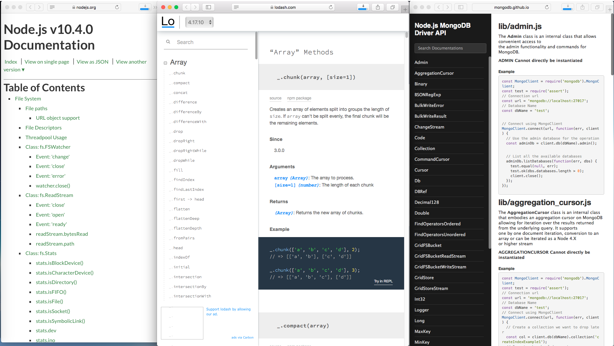
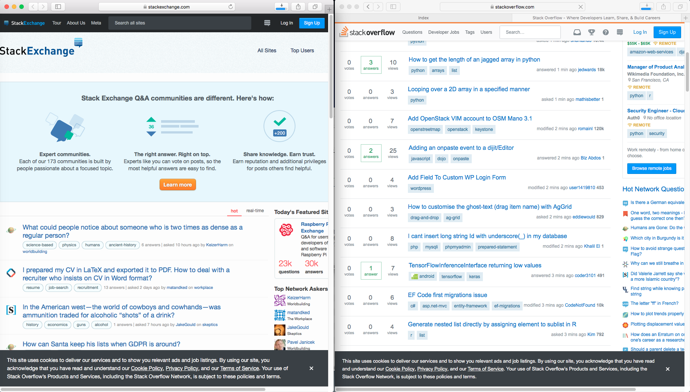
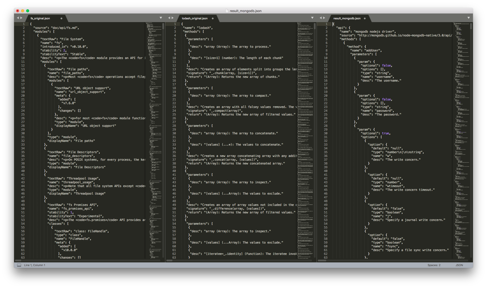
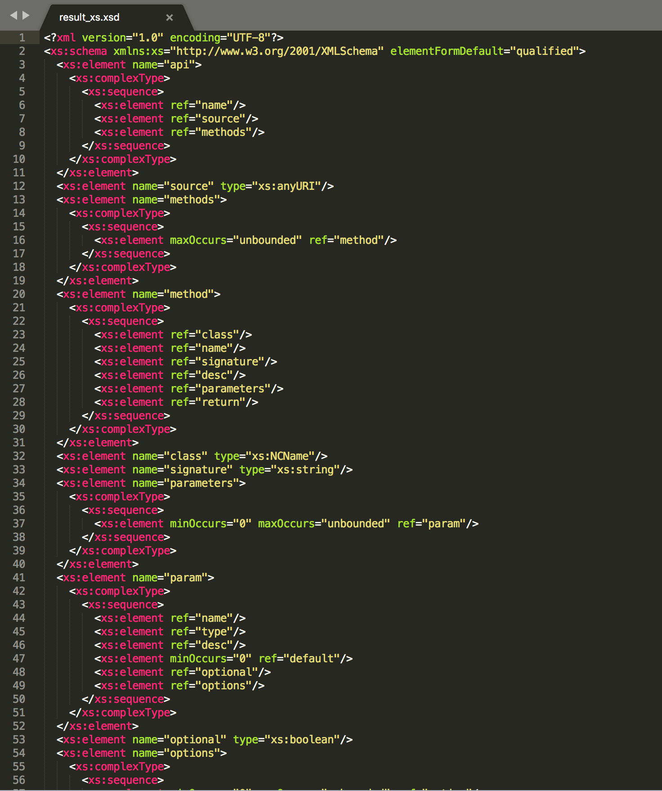
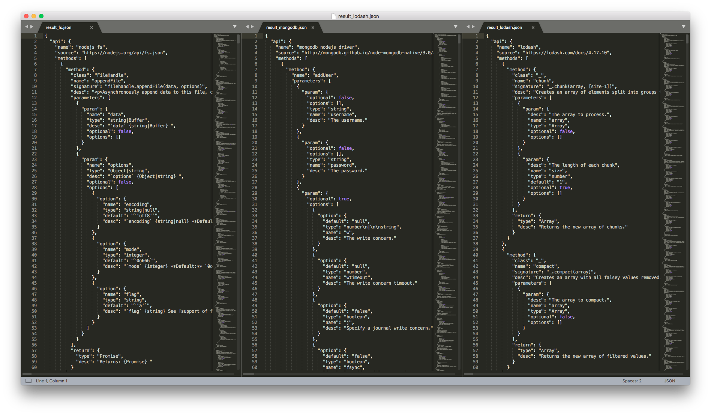
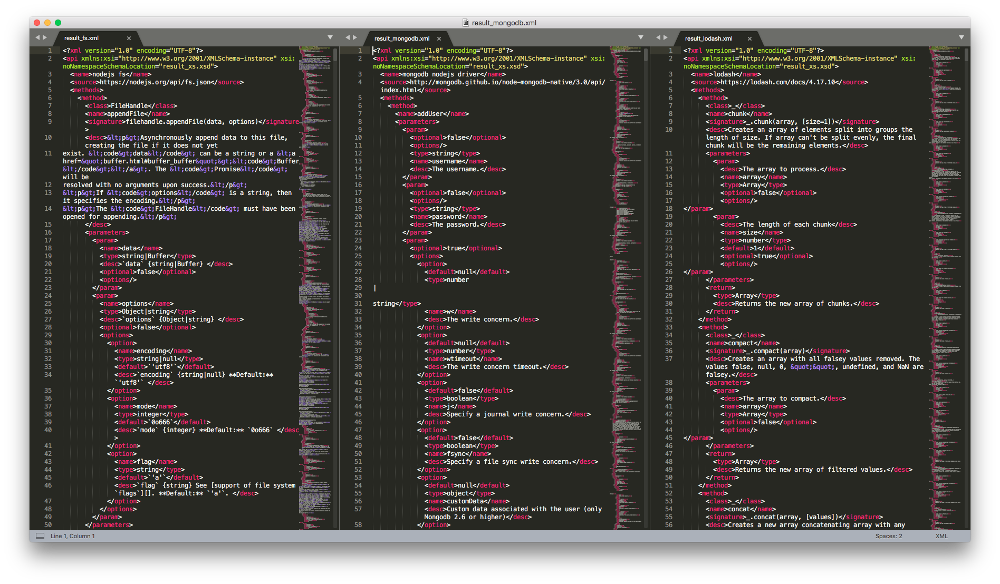
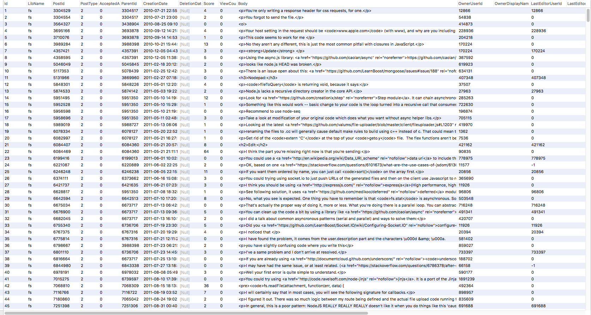
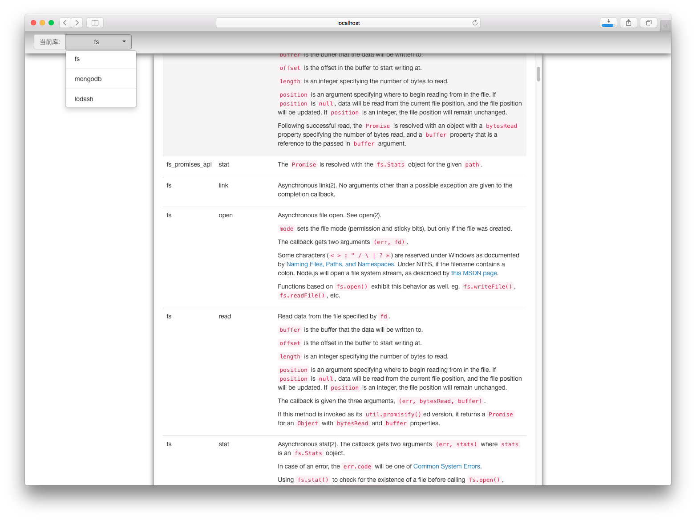
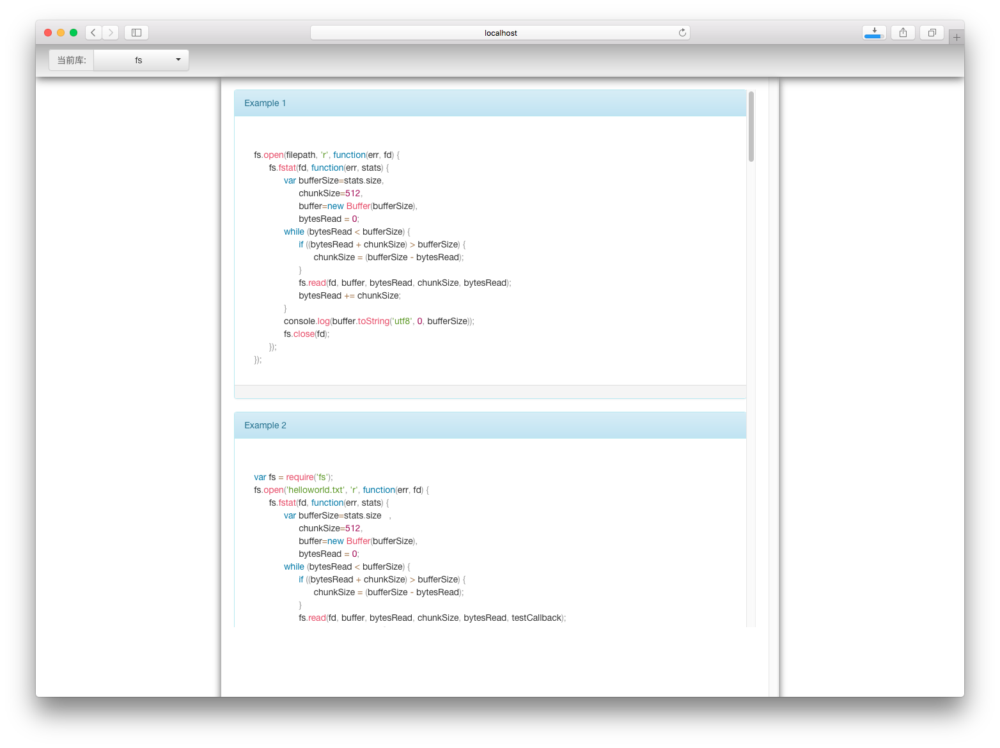

#
# 一. 项目背景与目标

学习新 API，是几乎每个程序员都要在整个职业生涯中不断遭遇的事情。官方的 API 往往会提供细到函数级别的文档，但实践表明这样的函数签名并不足以支持程序员学习 API ，实证领域的研究表明，在职业开发者眼里，主流的 API 文档有众多缺陷，而最欠缺的就是代码例子。通过例子，程序员可以看到 API 实际使用的上下文，对 API 背后的设计初衷有更深刻的认识，而例子中的优秀实践也能帮助他们更准确、高效地使用 API 。

另一方面，Stack Overflow 社区拥有大量的、基于问答形式的代码片段，其中就包含了大量的 API 使用例子。

我们希望从 JavaScript 的一些库 API 入手，做一个集成了多个流行库 API 与对应的 Stack Overflow 上的代码实例的“文档仓库”。使用者可以以统一的界面和检索方式查看不同库的 API 基础信息（来源于官方文档）与它们的代码实例（来源于 Stack Overflow 社区）。

# 2. 数据来源

在 API 的基础信息上， 我们选取了 [lodash](https://lodash.com/docs/4.17.10), [nodejs fs module](https://nodejs.org/api/fs.html), [mongodb nodejs driver](http://mongodb.github.io/node-mongodb-native/3.0/api/) 三个热门的 node 库，分别爬取了它们的 API 文档。

Node.js fs / lodash / mongodb 官方 API

对于 API 的代码实例，我们使用了 StackExchange 提供的 [Stack Exchange Data Dump](https://archive.org/details/stackexchange) 服务，同时利用 Stack Exchange 提供的 Query 查询服务并提取到了和上述三个 node 库相关的问答和其中的 code 。

Stack Exchange 与 Stack Overflow 社区

# 3. API 基础信息的异构性

### 3个 node 库的 API 数据的异构
其主要来源于以下两个因素：

- 它们对一个方法的描述的信息量不同，如版本号、可能抛出的异常、对应的源码位置，有的库有而有的库没有。
- 它们对同样的信息的组织形式不同，如 lodash 的文档是把参数默认值放在函数签名里面以赋值的形式给出，而 nodejs 的文档是把默认值放在了参数的详细描述里。

基于以上原因和分工方式，我们获取到的3份 raw data 在结构上都有区别：我们使用 ParseHub 图形化爬虫工具爬取了 lodash 的 json 格式的文档，直接下载了 nodejs fs module 提供的 json 格式的文档，使用 Scrapy 获得了 mongodb nodejs driver 的 json 格式的文档，它们的 json 结构都有区别（见下图）。

原始的异构 json 数据文件

此外，node 库的方法与 Stack Overflow 社区上关于同一库的方法的表述和存储也存在形式不一致的异构性。

# 4. 数据集成及匹配

### 4.1 数据集成

为了实现将这3份异构数据以一种同构的方式集成到应用的数据库中，我们为数据库接受的格式定义了 XML Schema(见下图：result_xs.xsd) ，然后分别写脚本将3份数据转成统一格式的 json ，使得转换后的 json 在转为 xml 时能满足 XML Schema 的验证(见下图）。 

result_xs.xsd

result_fs / result_mongodb / result_lodash.json

完成集成后同构的 xml 数据文件

同时，我们将 Stack Overflow 社区上的提问与回答数据写入同一个数据库中。

Stack Overflow 社区上的问答数据

### 4.2 数据匹配

鉴于数据量较多，匹配存在耗时过长、给用户体验不佳的可能性，所以为了用户的使用效率和性能考虑，我们决定对现有数据先进行匹配并存进数据库，以便于能够在用户使用时能够直接获取到数据，而不是临时去匹配。

至于具体的匹配方法，我们是对需要分析的 JavaScript 库中的每一个方法，均与 Stack Overflow 中的所有数据帖子进行比较，若帖子中含有此方法名并且同属于一个库，那么就将此帖子记录，存进数据库。

# 5. 展示的部分说明

我们为此项目搭建了一个用于用户展示的 Web Demo。此 Demo 运行在 Tomcat 容器中，可以为用户展示 Node.js API 中的各方法以及这些方法的代码实例（来源于 Stack Overflow 社区）。

Node 库展示界面

代码实例 展示界面

